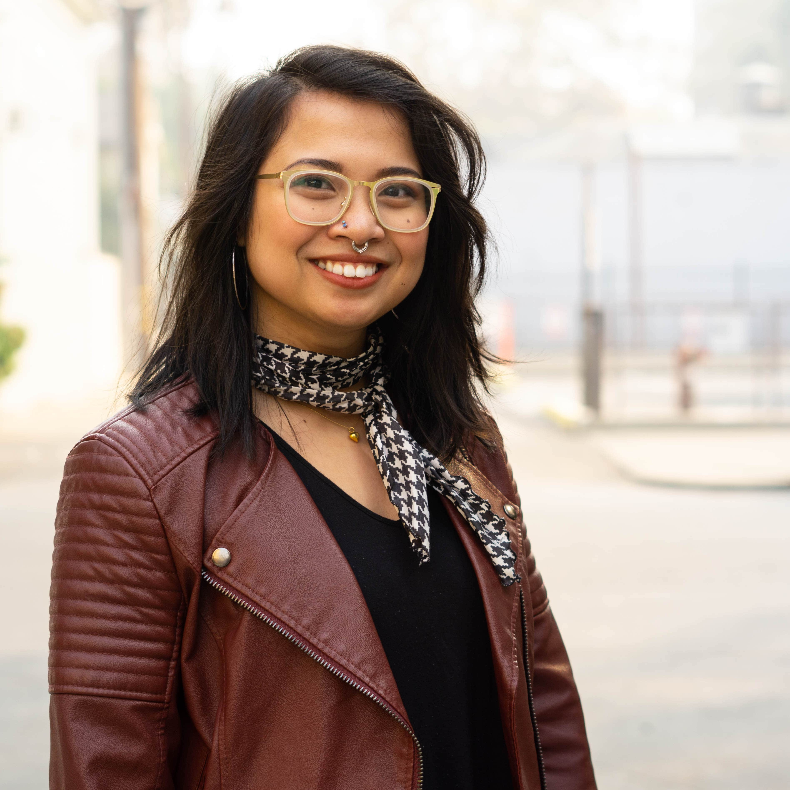
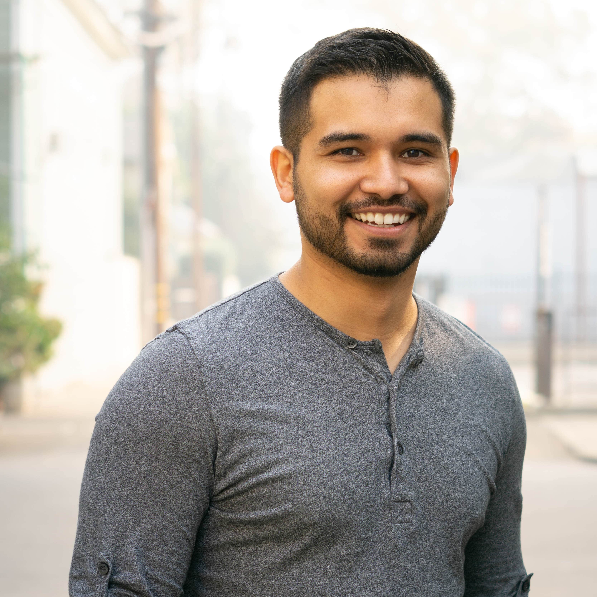
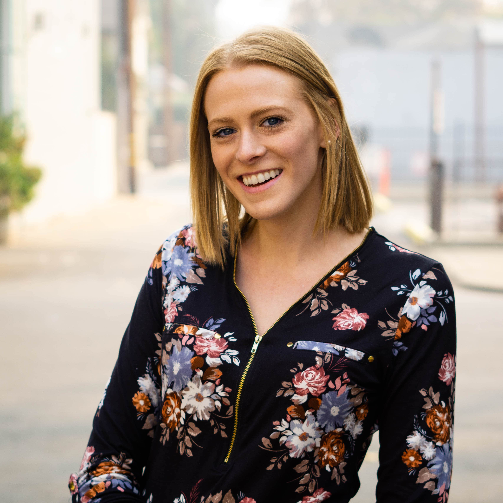
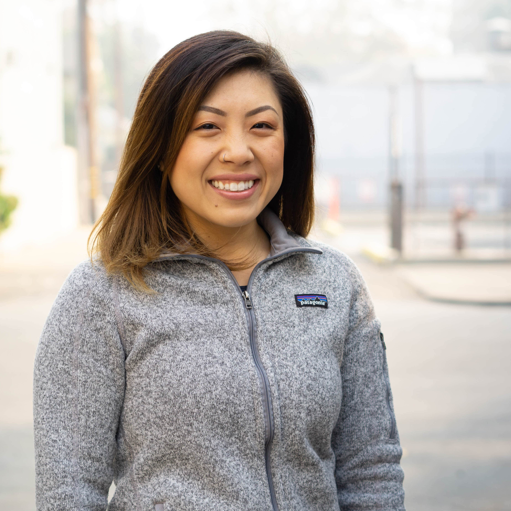
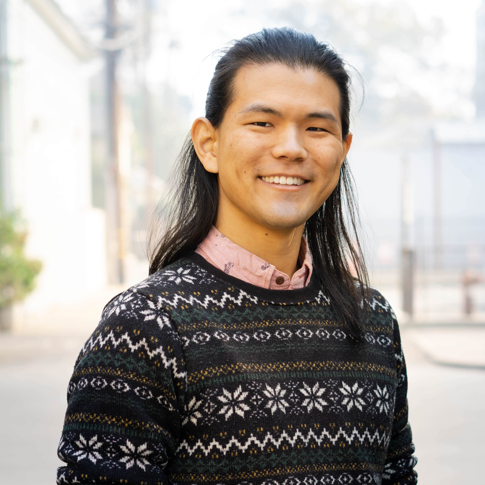
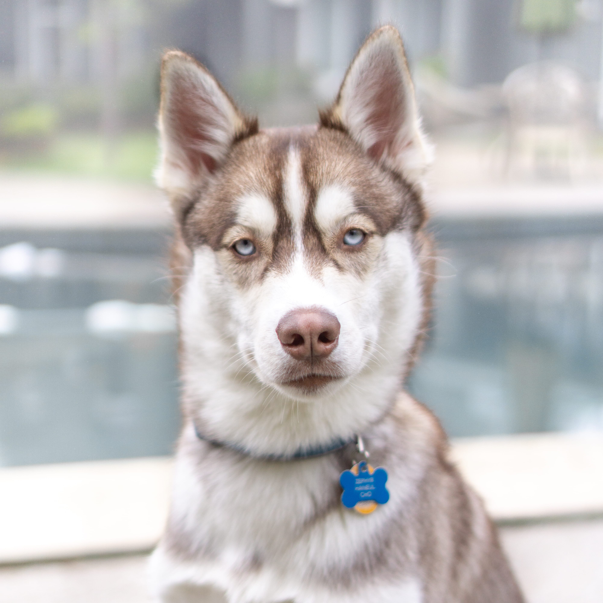

  
{{ site.description | escape }}

  
Come join us at our next <strong>Café Chat or Workshop</strong>:

**[Sac Desco's Upcoming Events (Facebook)](https://www.facebook.com/pg/sacdesco/events/)**
  
Interested in presenting a workshop or being a Café Chat guest? <a href="mailto:thisisdesco@gmail.com?subject=Workshop or Cafe Chat Inquiry">Send us an email</a> and we'll give you the details!

  

  

  
No Facebook? No problem! Join us on Slack at [Sac Desco Slack group](https://bit.ly/2ON47xl)!

## PLEASE READ

<a href="https://drive.google.com/open?id=12XppL2fxflYKkLUFzKb3XMsrcGRSPbpbUBo33UAugAo" target="_blank">Our Code of Conduct and Community Guidelines</a>

Participation in this collective via Facebook, Slack, or in-person means that you agree to our Code of Conduct and understand our guidelines.

## OUR MISSION
Sac Desco (Design Collective)'s goal is to provide a community in Sacramento for individuals from all backgrounds, fields and skill levels who are interested in design and design thinking.

Our members come from diverse backgrounds such as: Biology, History, Software Engineering, Design, Cognitive Science, and Human Development.

Our interests include: UX, UI, illustration, web design, photography, typography & lettering, graphic design, branding, and beyond.

## WHAT DO WE DO

Our collective encourages the intersection of technology and interdisciplinary studies. We meet monthly (in person) to discuss design and its related topics in a safe and inclusive environment. For those that can’t join us in person, we also have online spaces where people of all skill levels can collaborate, exchange ideas, learn, receive feedback, maintain accountability, and network.

We approach design from a modern and practical standpoint and hope to work together to improve the overall quality of the craft.

## Follow Us on INSTAGRAM
<!-- SnapWidget -->

<iframe src="https://snapwidget.com/embed/617434" class="snapwidget-widget" allowtransparency="true" frameborder="0" scrolling="no" style="border:none; overflow:hidden; width:100%; "></iframe>

<h2>DESCO Organizers</h2>
<ul class="">
  <li>
  
Kimberly Gail Loseñara

  Kimberly is a designer and lettering artist, refining her UX skills and immersing herself in Sacramento's design community. She runs a freelance design studio (Be Wilder Creative) and specializes in 5-minute power naps. Talk to her about inclusive design, typography, and local concerts ✌🏼.
  
Instagram: <a href="https://instagram.com/thingsmyhands" target="_blank">thingsmyhands</a> // Twitter: <a href="https://twitter.com/kmbrlygl" target="_blank">kmbrlygl</a> // Dribbble: <a href="https://dribbble.com/kmbrlygl" target="_blank">kmbrlygl</a>
</li>
  <li>
  
Ivan Villa

  Ivan is the lead web developer and co-founder of Scribe — a full service digital creative agency in Sacramento. His passion for design and programming keeps him active in the community. His current interests include, performant web design, web animations, and interactive design.
  
Instagram: <a href="https://instagram.com/ivanvillacreative" target="_blank">ivanvillacreative</a> // Twitter: <a href="https://twitter.com/ivan_villa" target="_blank">ivan_villa</a> // Dribbble: <a href="https://dribbble.com/ivanvilla" target="_blank">ivanvilla</a>
</li>
  <li>
  
Noelle Szombathy

  Noelle is a graphic designer and photographer whose inspiration is fueled by travel. She specializes in brand identity and editorial designs. She is always on the hunt for her next adventure and will always jump at an opportunity to expand her toolbox and take on a new challenge.
  
Instagram: <a href="https://instagram.com/noellered" target="_blank">noellered</a>
</li>
  <li>
  
Tanushree Padath

  Tanu is a former Biologist crafting her skills in Design and User Research. Her true passion lies in the preliminary stages of design - analyzing the user's needs and behavior before problem solving. Talk to her about your favorite hike or podcast!
  
Instagram: <a href="https://instagram.com/_tan_u" target="_blank">_tan_u</a>
</li>
  <li>
  
Mandi Saeteun

  Mandi is a design generalist who enjoys tinkering with data, sketching with sharpies and jamming on front-end code to make products better. When she isn’t running operations at Excel Interpreting & Translating, you’ll find her climbing outdoors or nestled up with the latest issue of Saga.
  
Instagram: <a href="https://instagram.com/mandimey" target="_blank">mandimey</a> // Twitter: <a href="https://twitter.com/mandi_mey" target="_blank">mandi_mey</a> // Dribbble: <a href="https://dribbble.com/mandimey" target="_blank">mandimey</a>
</li>
  <li>
  
Milo Cho

  Milo is a designer with a previous life as a front-end developer. He's inspired by mismatched interactions, and he enjoys seeking out unknown unknowns. You can also find him traveling in his retrofitted minivan, taking photos, or playing with his dog.
  
Instagram: <a href="https://instagram.com/bymilocho" target="_blank">bymilocho</a>
</li>
  <li>
  
Zephyr

  Zephyr is our mascot. He is a young pup full of energy and curiosity. He happily encourages everyone with hugs and kisses especially when belly rubs and treats are involved. He also enjoys play dates, tug-of-war, and new smells.
  </li>
</ul>

