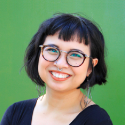
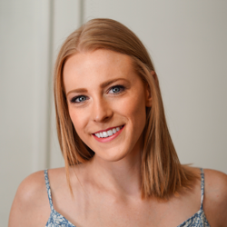
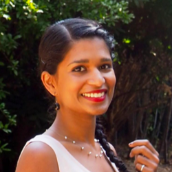
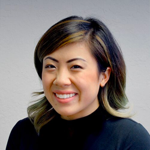

  
{{ site.description | escape }}

  
We’re looking for a space to have our bimonthly events. Please <a href="mailto:kim@thisisdesco.com">contact us</a> if you have a space available.

  

  
Want to attend our next event? Maybe learn something new? Join our community!

## PLEASE READ
<a href="https://drive.google.com/open?id=12XppL2fxflYKkLUFzKb3XMsrcGRSPbpbUBo33UAugAo" target="_blank">Our Code of Conduct and Community Guidelines</a>

## OUR MISSION
Our goal is to provide a community in Sacramento for diverse individuals like ourselves. We welcome those from all fields and backgrounds who are interested in design and design thinking.

We specialize in these areas: UX, UI, illustration, web design, photography, typography & lettering, graphic design, branding, and beyond.

We want to create an environment that fosters learning and discussion around design and its related topics. Our community is a safe and inclusive space, online and in person, where people of all skill levels can collaborate, exchange ideas, learn, receive feedback, maintain accountability, and network.

Our collective encourages the intersection of technology and interdisciplinary studies. We approach design from a standpoint of modernity and practicality, and hope to work together to improve the overall quality of the craft.

<h2>Who we are</h2>
<ul class="">
  <li>
  
Kimberly Gail

  Kimberly is a designer and lettering artist, refining her UX skills and immersing herself in Sacramento's design community. She runs a freelance design studio (Be Wilder Creative) and specializes in 5-minute power naps. Talk to her about inclusive design, typography, and local concerts ✌🏼.
  
Instagram: <a href="http://instagram.com/thingsmyhands" target="_blank">thingsmyhands</a> // Twitter: <a href="https://twitter.com/kmbrlygl" target="_blank">kmbrlygl</a> // Dribbble: <a href="https://dribbble.com/kmbrlygl" target="_blank">kmbrlygl</a>
</li>
  <li>
  
Ivan Villa

  Ivan is the lead web developer and co-founder of Scribe — a full service digital creative agency in Sacramento. His passion for design and programming keeps him active in the community. His current interests include, performant web design, web animations, and interactive design.
  
Instagram: <a href="http://instagram.com/ivanvillacreative" target="_blank">ivanvillacreative</a> // Twitter: <a href="https://twitter.com/ivan_villa" target="_blank">ivan_villa</a> // Dribbble: <a href="https://dribbble.com/ivanvilla" target="_blank">ivanvilla</a>
</li>
  <li>
  
Noelle Szombathy

  Noelle is a photographer and designer who is inspired by travel. She's worked on a range of projects - from logo design to personalized illustrations. As a rookie in the formal design world, she is always looking to expand her toolbox and jump head-first into a new challenge.
  
Instagram: <a href="http://instagram.com/noellered" target="_blank">noellered</a>
</li>
  <li>
  
Tanu Padath

  Tanu is a former Biologist crafting her skills in Design and User Research. Her true passion lies in the preliminary stages of design - analyzing the user's needs and behavior before problem solving. Talk to her about your favorite hike or podcast!
  
Instagram: <a href="http://instagram.com/_tan_u" target="_blank">_tan_u</a>
</li>
  <li>
  
Mandi Saeteun

  Mandi is a design generalist who enjoys tinkering with data, sketching with sharpies and jamming on front-end code to make products better. When she isn’t running operations at Excel Interpreting & Translating, you’ll find her climbing outdoors or nestled up with the latest issue of Saga.
  
Instagram: <a href="http://instagram.com/mandimey" target="_blank">mandimey</a> // Twitter: <a href="https://twitter.com/mandi_mey" target="_blank">mandi_mey</a> // Dribbble: <a href="https://dribbble.com/mandimey" target="_blank">mandimey</a>
</li>
</ul>

